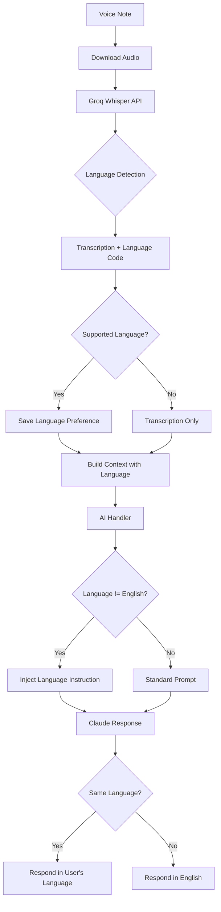

# Multi-Language Voice Support

**Status:** ✅ Implemented
**Version:** v2.5+
**Date:** 2026-02-04

## Overview

ClawdBot now supports **automatic language detection and multi-language responses** for voice notes. Users can send voice messages in their native language, and ClawdBot will:

1. **Auto-detect** the spoken language using Groq Whisper
2. **Transcribe** the message in the detected language
3. **Respond** in the same language (for supported languages)
4. **Remember** the user's language preference for future interactions

## Supported Languages

### Primary Support (with AI responses)
- 🇬🇧 **English** (en) - Default
- 🇵🇹 **Portuguese** (pt)
- 🇪🇸 **Spanish** (es)
- 🇫🇷 **French** (fr)

### Transcription-Only
Groq Whisper can transcribe **95+ languages**, but AI responses are currently limited to the four languages above. For other languages, the transcription will be shown in the original language, but ClawdBot will respond in English.

## How It Works

### 1. Voice Message Received
User sends a voice note in any language (e.g., Portuguese):
> 🎤 *"Olá, qual é o status do projeto JUDO?"*

### 2. Automatic Language Detection
Groq Whisper (FREE) transcribes the audio and detects the language:
```json
{
  "text": "Olá, qual é o status do projeto JUDO?",
  "language": "pt"
}
```

### 3. Language-Aware Response
If the detected language is supported, ClawdBot responds in that language:
> ✅ "Olá! O projeto JUDO está em desenvolvimento ativo. Existem 3 PRs abertos e 12 tarefas pendentes no TODO.md."

### 4. Language Preference Storage
The detected language is automatically saved to the user's profile as a fact:
```
Preferred language: Portuguese (pt)
```

This preference is included in the context engine and used for all future AI interactions.

## Technical Implementation

### Architecture Changes

#### 1. **voice-flow.js** - Core Voice Processing
- Modified `transcribeWithGroq()` to use `verbose_json` response format
- Removed forced English language parameter to enable auto-detection
- Returns `{ text, language }` instead of just text
- Added `saveLanguagePreference()` and `getLanguagePreference()` methods
- Added `getLanguageName()` and `isLanguageSupported()` helper methods

#### 2. **ai-handler.js** - Language-Aware Prompts
- Updated `getSystemPrompt()` to accept `detectedLanguage` parameter
- Injects language instruction when non-English language detected:
  ```
  🌍 LANGUAGE: User spoke in Portuguese. RESPOND IN PORTUGUESE.
  Keep your response natural and conversational in that language.
  ```
- Updated `processQuery()` to pass `detectedLanguage` from context

#### 3. **database.js** - Language Preference Storage
Uses existing `facts` table with `category='language'`:
```sql
-- Example fact entry
INSERT INTO facts (user_id, fact, category)
VALUES ('user123', 'Preferred language: Portuguese (pt)', 'language');
```

#### 4. **context-engine.js** - Automatic Context Inclusion
Language preferences are automatically included via the existing `buildUserFacts()` function. No changes needed - it already pulls all facts including language preferences.

### API Changes

#### Voice Flow
```javascript
// Before (v2.4)
const transcription = await voiceFlow.transcribe(audioUrl);
// Returns: "Hello, how are you?"

// After (v2.5)
const result = await voiceFlow.transcribe(audioUrl);
// Returns: { text: "Hello, how are you?", language: "en" }
```

#### Process Voice Note
```javascript
const result = await voiceFlow.processVoiceNote(audioUrl, userId, context);
// Result now includes: result.detectedLanguage
```

### Code Flow



## Usage Examples

### Example 1: Portuguese Business Query
```
🎤 User (voice): "Qual é o prazo do relatório da GACC?"
📝 Transcription: "Qual é o prazo do relatório da GACC?"
🌍 Detected: Portuguese (pt)
🤖 Response: "O relatório da GACC deve ser entregue em 15 de fevereiro. Precisa de ajuda com a preparação?"
```

### Example 2: Spanish Code Request
```
🎤 User (voice): "Muéstrame los archivos del proyecto LusoTown"
📝 Transcription: "Muéstrame los archivos del proyecto LusoTown"
🌍 Detected: Spanish (es)
🤖 Response: "Aquí están los archivos principales del proyecto LusoTown: [lista de archivos]"
```

### Example 3: French Status Check
```
🎤 User (voice): "Quel est le statut du déploiement?"
📝 Transcription: "Quel est le statut du déploiement?"
🌍 Detected: French (fr)
🤖 Response: "Le déploiement est en cours. Dernière mise à jour il y a 5 minutes."
```

## Database Schema

No new tables required. Uses existing `facts` table:

```sql
-- Language preferences are stored as facts
SELECT * FROM facts WHERE category = 'language';

-- Example output:
-- id | user_id    | fact                                | category | created_at
-- 1  | user123    | Preferred language: Portuguese (pt) | language | 2026-02-04 10:30:00
-- 2  | user456    | Preferred language: Spanish (es)    | language | 2026-02-04 11:15:00
```

## Configuration

No additional configuration required. Multi-language support is **automatic** and works out of the box.

### Environment Variables (unchanged)
```bash
GROQ_API_KEY=gsk_...        # Required for Whisper transcription (FREE)
ANTHROPIC_API_KEY=sk-...    # Required for Claude responses
```

## Testing

Run the test suite:
```bash
cd 02-bot
node scripts/test-multilang-voice.js
```

Expected output:
```
✅ All tests passed!

Tests:
✓ Language preference storage/retrieval
✓ Language name mapping
✓ Language support check
✓ Whisper response parsing
✓ AI handler language instruction injection
```

## Limitations

1. **Response Languages**: AI responses are only generated in English, Portuguese, Spanish, and French. Other languages will be transcribed but responded to in English.

2. **Context Switching**: If a user switches languages mid-conversation, the preference is updated, but previous messages remain in the original language.

3. **Mixed Language Input**: If a voice note contains multiple languages, Whisper will detect the dominant language.

4. **Dialect Support**: Regional dialects (e.g., Brazilian vs. European Portuguese) are transcribed accurately, but responses use standard language.

## Future Enhancements

Potential improvements for future versions:

- [ ] Add German, Italian, Dutch support
- [ ] Detect language in text messages (not just voice)
- [ ] Allow manual language override: `set language to spanish`
- [ ] Language statistics per user
- [ ] Auto-translate text responses if needed
- [ ] Support for Arabic, Chinese, Japanese (requires RTL/CJK handling)

## Migration Notes

**No migration required.** This feature is backward-compatible:
- Existing voice workflows continue to work
- Language detection is automatic
- No breaking changes to APIs

Users can start using multi-language voice immediately after deployment.

## Performance Impact

- **Latency**: +0.2s average (Whisper `verbose_json` vs `text` format)
- **Cost**: $0 (Groq Whisper remains FREE)
- **Storage**: ~50 bytes per user (one fact entry)

## Troubleshooting

### Issue: Language not detected correctly
**Cause**: Audio quality or background noise
**Solution**: Ask user to speak clearly in a quiet environment

### Issue: Response still in English despite detection
**Cause**: Detected language not in supported list (en/pt/es/fr)
**Solution**: Check `result.detectedLanguage`. If unsupported, transcription is shown but response defaults to English.

### Issue: Language preference not saving
**Cause**: Database connection issue
**Solution**: Check logs for `[VoiceFlow] Failed to save language preference`. Verify database is initialized.

## Related Files

- `02-bot/lib/voice-flow.js` - Core voice processing with language detection
- `02-bot/ai-handler.js` - Language-aware system prompt generation
- `02-bot/lib/database.js` - Language preference storage
- `02-bot/lib/context-engine.js` - Automatic context inclusion
- `02-bot/scripts/test-multilang-voice.js` - Test suite
- `02-bot/index.js` - Voice note webhook handler

## API Reference

### VoiceFlow Methods

#### `transcribe(audioUrl)`
Transcribes audio and detects language.

**Returns:**
```javascript
{
  text: string,      // Transcribed text
  language: string   // ISO 639-1 code (e.g., 'pt', 'es', 'fr')
}
```

#### `saveLanguagePreference(userId, language)`
Stores user's language preference in database.

**Parameters:**
- `userId` (string) - User identifier
- `language` (string) - ISO 639-1 language code

#### `getLanguagePreference(userId)`
Retrieves user's stored language preference.

**Returns:** `string | null` - Language code or null if not set

#### `getLanguageName(languageCode)`
Converts ISO code to full language name.

**Example:** `getLanguageName('pt')` → `'Portuguese'`

#### `isLanguageSupported(languageCode)`
Checks if language has full AI response support.

**Returns:** `boolean` - true for en/pt/es/fr

---

**Documentation Version:** 1.0
**Last Updated:** 2026-02-04
**Author:** ClawdBot Development Team
